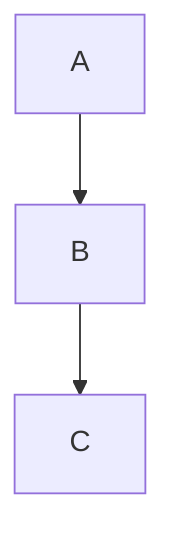

# mermaid (sample plugin)

Render ```mermaid fenced code blocks. This sample is a **stub** — it draws
an ASCII-styled box around the diagram source rather than rendering real
SVG, so the example stays inside the v1.3 bundle budget.

## What it does

````md

````

→

```html
<div class="ms-mermaid-stub">[mermaid: graph TD\n  A --> B\n  B --> C]</div>
```

## Install

1. Copy `examples/plugins/mermaid/` to `~/.markspread/plugins/mermaid/`.
2. Reload Markspread (or hit **Reload** in the Plugin Author Panel).
3. Open any `.md` containing a ```mermaid``` block and check the preview.

## Permissions

None. The plugin runs in a Web Worker with no network and no fs access.

## Upgrade to real rendering

Swap the `renderMermaid` stub for a call into `mermaid.js`. You will need
to:

1. Add `"network"` to `permissions` and `"esm.sh"` (or wherever you host
   mermaid) to `allowedHosts` in `markspread-plugin.json`.
2. Re-grant the permission via the consent dialog after reload.
3. Replace the stub with a `mermaid.render(...)` call returning SVG.

The Markspread runtime sanitizes the returned HTML via `DOMPurify`, so
SVG output must use only `DOMPurify`-allowed tags / attributes.
